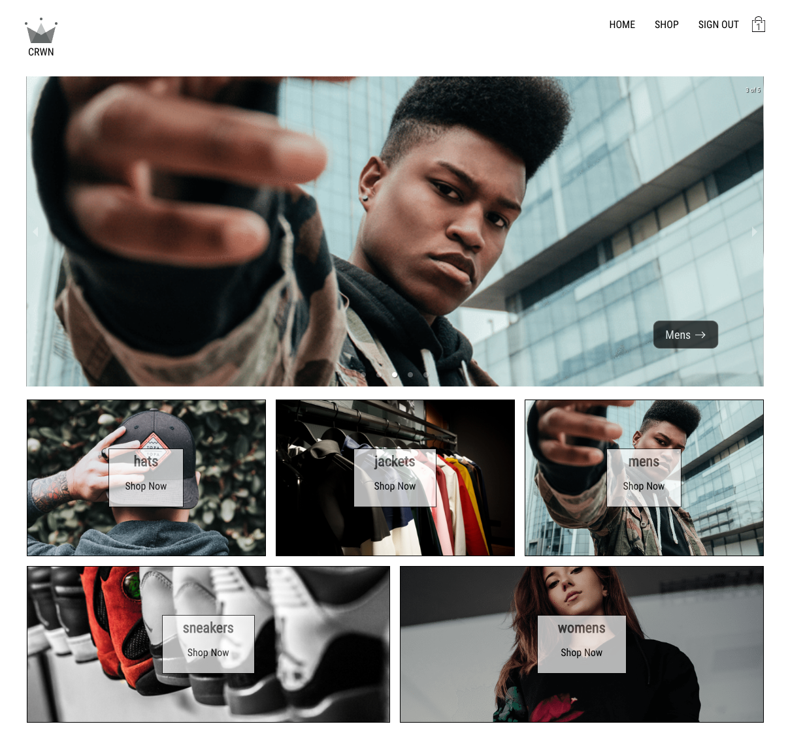
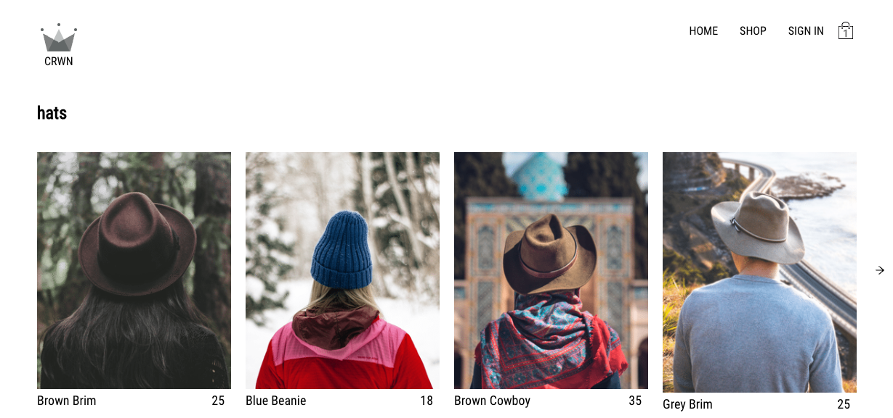
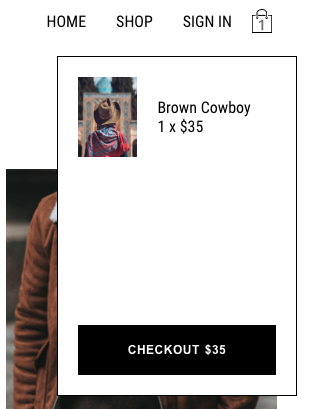
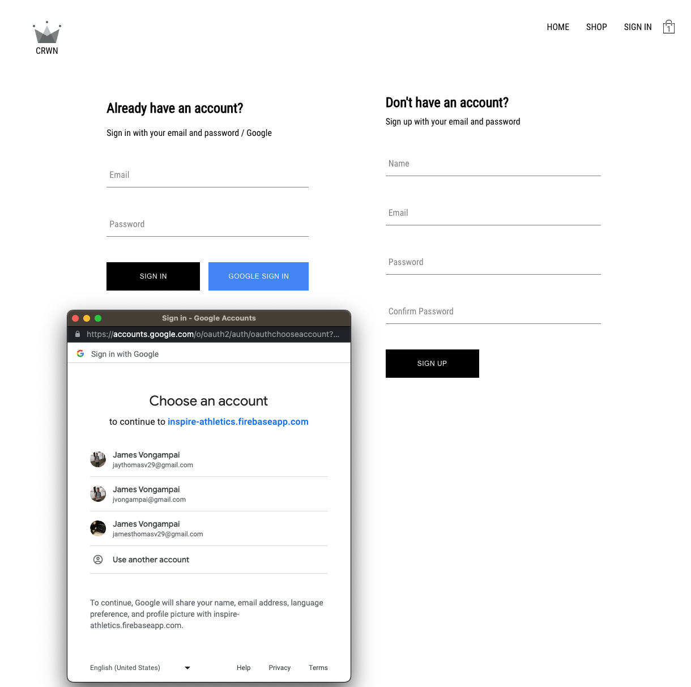
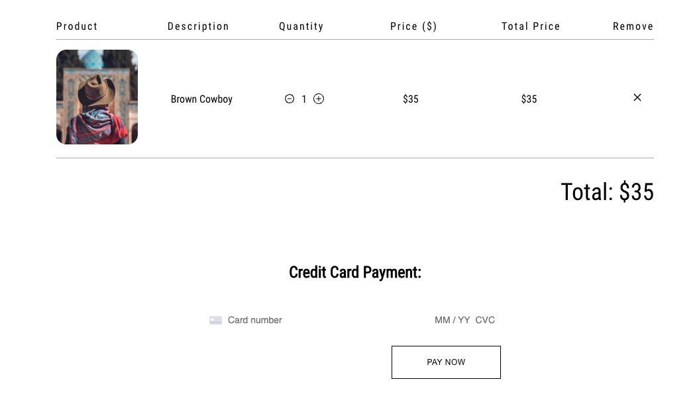

# CRWN Clothing Ecommerce App

[View Live Demo Here](https://storied-quokka-79b623.netlify.app/)
CRWN is a clothing line ecommerce store built with React and a variety of other technologies to create a robust, performant, and user-friendly application.

# Overview
### Home Page

---
### Product Category Preview Page

---
### Cart Component

---
### Google / Email Authentication Page

---
### Checkout Page

---
## Features

CRWN has the following features:
- User authentication and account management
- Full stack application built with Firebase
- Responsive and mobile-friendly design
- Online payment processing with the Stripe API
<!-- - Integration with GraphQL and Apollo for efficient data fetching
- Performance optimizations with React Suspense, React Lazy, and state normalization
- Testing with Jest and snapshot testing -->
- Routing with React Router

## Technologies Used

- React Basics
- Creating Custom CSS Carousel / Sliders
- React Router
- Redux
- Redux Saga
- Asynchronous Redux
- React Hooks
- Context API
- React Suspense + React Lazy
- Firebase
- Stripe API
- Styled-Components
- GraphQL
- Apollo
- PWAs
- React Performance
- React Design Patterns
- Testing with Jest and Snapshot testing
- React Best Practices
- Persistance + Session Storage
- State Normalization

## Getting Started

To get started with the CRWN app:

1. Clone the repository to your local machine
2. Install the necessary dependencies with `npm install`
3. Start the development server with `npm start`
4. View the app in your browser at `http://localhost:3000`

## Conclusion

CRWN is a comprehensive and feature-rich ecommerce application built with React and a variety of other technologies. By achieving the above learning objectives, the developer of this application has gained a deep understanding of React development and is well-equipped to lead future React projects.
